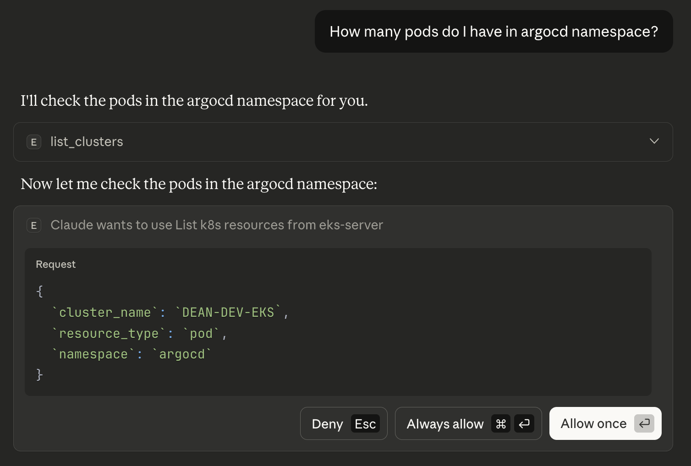
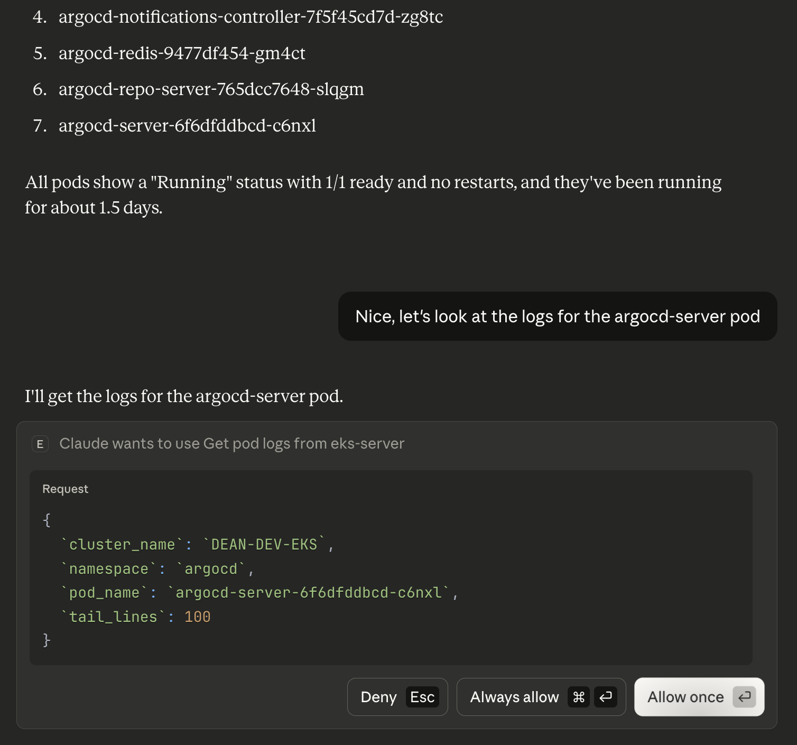
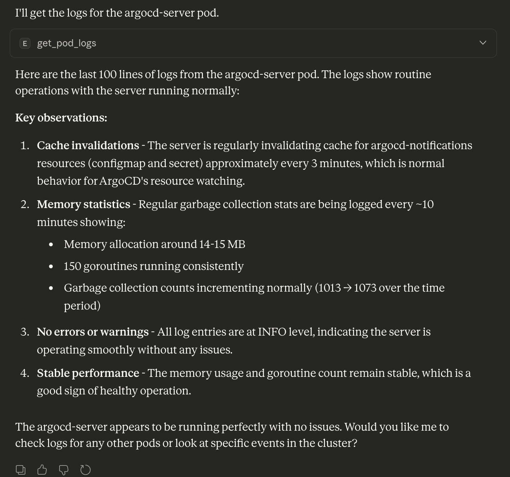

# Simple EKS MCP Server

A simplified MCP server for EKS.

## What This Implements

This is a **learning implementation** to shows the basics of:

1. How to structure an MCP server in Python
2. How to register and expose tools to Claude
3. How to handle tool calls and return results
4. How to implement read-only vs write mode
5. How to integrate with EKS and Kubernetes APIs
6. How the tool call flow actually works

## Features

### Read-Only Tools (Default)
-  `list_clusters` - List all EKS clusters
-  `describe_cluster` - Get cluster details
-  `list_k8s_resources` - List pods, services, deployments, nodes
-  `get_resource_details` - Get detailed info about a specific resource
-  `get_pod_metrics` - Get CPU and memory metrics for pods

### Sensitive Data Tools (Requires `--allow-sensitive-data-access`)
-  `get_pod_logs` - Retrieve pod logs
-  `get_events` - Get Kubernetes events

### Write Tools (Requires `--allow-write`)
-  `delete_pod` - Delete a pod
-  `scale_deployment` - Scale a deployment

## Pre-reqs
- uv
- aws-cli
- kubectl
- cluster auth

### How to run this server

```bash
# Read-only mode (default)
uv run src/eks_mcp_server/main.py

# With sensitive data access
uv run src/eks_mcp_server/main.py --allow-sensitive-data-access

# With write access (be carefull with this)
uv run src/eks_mcp_server/main.py --allow-write --allow-sensitive-data-access
```

```json
{
  "mcpServers": {
    "eks-server": {
      "command": "<ABSOLUTE_PATH_TO_UV>",
      "args": [
        "run",
        "--directory",
        "ABSOLUTE_PATH_TO_eks_mcp_server_folder",
        "main.py",
        "--allow-sensitive-data-access"
      ],
      "env": {
        "AWS_PROFILE": "YOUR_AWS_PROFILE_NAME",
        "AWS_REGION": "CLUSTER_REGION",
        "KUBECONFIG": "ABSOLUTE_PATH_TO_KUBECONFIG"
      }
    }
  }
}
```
### Restart Claude Desktop, and you'll see the tools available in the chat.
### Let's see it in action:




